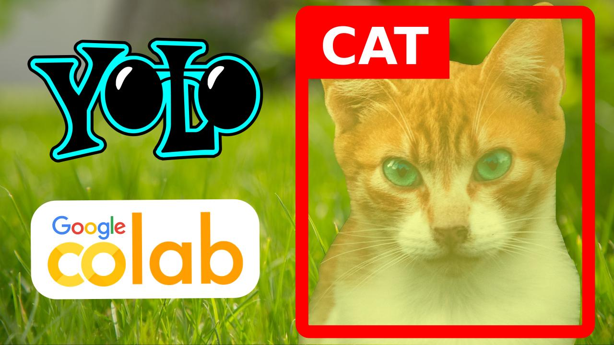

# train-yolov8-semantic-segmentation-google-colab

## dataset

Check out [this amazing resource](https://www.patreon.com/posts/download-dataset-93767962) to download a semantic segmentation dataset from the Google Open Images Dataset v7, in the exact format you need in order to train a model with Yolov8! 
